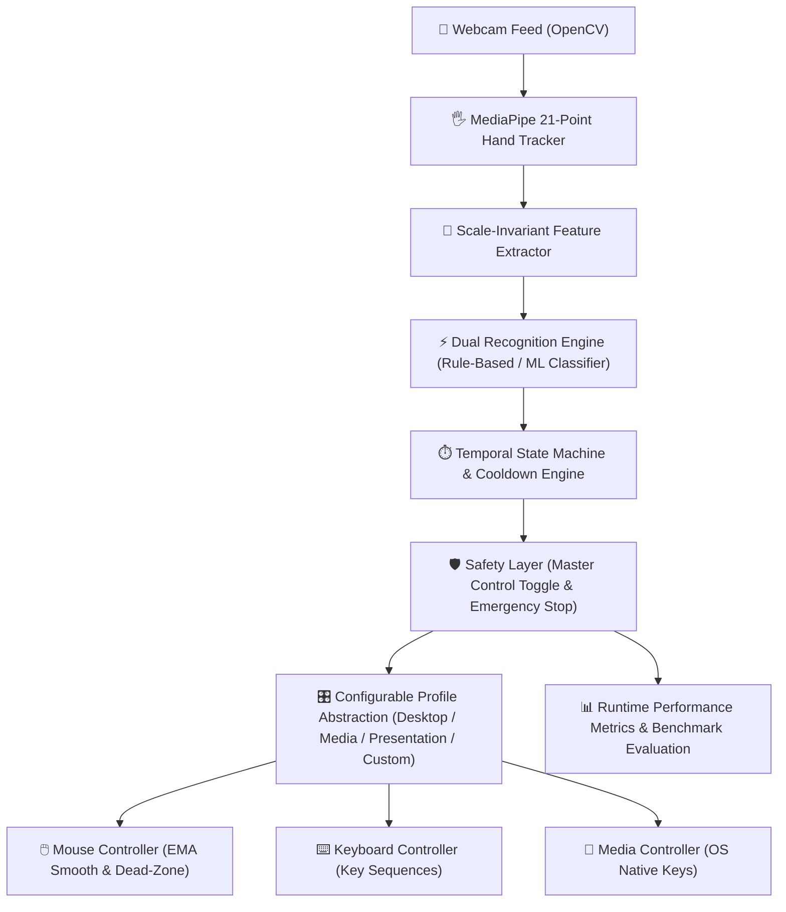

# GestureControl AI — Real-Time Touchless Computer Interaction System

[](https://github.com/vishal-s-sollapure/Gesture-control-main/actions/workflows/tests.yml)
[](https://www.python.org/)
[](LICENSE)
[](#windows-executable-packaging)

> **Real-time touchless desktop interaction system built with Python, OpenCV, MediaPipe, and PyAutoGUI. Translates 21-point 3D hand landmark geometry into mouse navigation, drag-and-drop, scrolling, media playback, and presentation controls.**

---

## 🏛️ System Architecture



### Text Architecture Overview
```
┌─────────────────────────────────────────────────────────────┐
│                       Hardware Layer                        │
│                 Webcam Video Stream (OpenCV)                │
└──────────────────────────────┬──────────────────────────────┘
                               │
                               ▼
┌─────────────────────────────────────────────────────────────┐
│                    Computer Vision Layer                    │
│            MediaPipe 21-Point Hand Landmark Tracking         │
└──────────────────────────────┬──────────────────────────────┘
                               │
                               ▼
┌─────────────────────────────────────────────────────────────┐
│                   Feature & Geometry Layer                   │
│         Wrist Translation + Span Scale Normalization        │
└──────────────────────────────┬──────────────────────────────┘
                               │
                               ▼
┌─────────────────────────────────────────────────────────────┐
│                  State Machine & Safety                     │
│         Temporal Debouncing + Emergency Stop Interlock       │
└──────────────────────────────┬──────────────────────────────┘
                               │
                               ▼
┌─────────────────────────────────────────────────────────────┐
│                    Action Dispatch Abstraction              │
│       Desktop Profile │ Media Profile │ Presentation Profile│
└───────────────┬──────────────┬──────────────┬───────────────┘
                │              │              │
                ▼              ▼              ▼
           Mouse Move      Key Press     Media Play/Pause
```

---

## 🌟 Key Engineering Features

### 1. 📐 Scale-Invariant Landmark Geometry
Hand tracking coordinates are normalized relative to palm scale and wrist position ($\mathbf{p}_i - \mathbf{p}_{\text{wrist}}$), guaranteeing robust gesture classification regardless of user hand size or distance from camera lens.

### 2. 🛡️ Safety-First Architecture
* **Default Startup State**: Starts strictly in `CONTROL: PAUSED` state to prevent accidental cursor jumps.
* **Instant Emergency Stop**: Triggers instant system control pause via dedicated **Fist Gesture** or global `ESC` key binding.
* **Auto-Release Drag Safety**: Automatically releases active mouse drag if tracking is lost or control is disabled.

### 3. 🧭 First-Run Guided Calibration Wizard
* Interactive guided calibration maps user-specific active reach boundaries (`margin_x`, `margin_y`) and samples personalized thumb-index pinch distance.
* Saves parameters directly to `settings.json` while keeping system mouse actions safely paused.

### 4. 🎛️ Configurable Gesture Profiles
Supports application-specific interaction profiles:
* **Desktop Profile**: Pointing $\rightarrow$ Cursor, Pinch $\rightarrow$ Left Click, Two Fingers $\rightarrow$ Right Click, Open Palm $\rightarrow$ Scroll, Pinch & Hold $\rightarrow$ Drag & Drop.
* **Presentation Profile**: Open Palm $\rightarrow$ Next Slide (`Right Arrow`), Three Fingers $\rightarrow$ Previous Slide (`Left Arrow`), Pointing $\rightarrow$ Laser Pointer.
* **Media Profile**: Thumbs Up $\rightarrow$ Play/Pause, Swipe Right $\rightarrow$ Next Track, Swipe Left $\rightarrow$ Previous Track.
* **Custom Profile**: User-configurable gesture-to-action dictionary persisted in settings.

### 5. 📊 Real-Time Runtime Performance Metrics
Collects empirical system metrics per session:
* **Frames Processed & Detection Rate %**
* **Real-time FPS & Average FPS**
* **Confirmed vs Rejected Gesture Counters**
* **False Trigger Rate % & Average Response Latency (ms)**

### 6. 🧪 Safe Gesture Evaluation Mode
* Evaluation benchmark mode prompts target gestures sequentially (`CURSOR`, `PINCH`, `RIGHT_CLICK`, `OPEN_PALM`, `THREE_FINGERS`, `DRAG`, `DOUBLE_PINCH`, `THUMBS_UP`, `SWIPE_LEFT`, `SWIPE_RIGHT`, `FIST`).
* Records empirical trial accuracy and response time without moving system mouse.
* Exports benchmark report to local `evaluation_results.json`.

### 7. 🤖 Extensible Machine Learning Pipeline (`ml/`)
* Contains dataset collection script (`ml/collect_data.py`), landmark preprocessor (`ml/preprocess.py`), Random Forest classifier trainer (`ml/train.py`), and model evaluator (`ml/evaluate.py`).
* Operates on normalized 63-dimensional landmark vectors:
  $$\mathbf{v}_{\text{normalized}} = \frac{\mathbf{p}_i - \mathbf{p}_{\text{wrist}}}{\max_{j} \|\mathbf{p}_j - \mathbf{p}_{\text{wrist}}\|}$$

---

## 🔒 Privacy & Local Processing Guarantee

* **100% Local Processing**: All OpenCV frame acquisition and MediaPipe landmark extraction occur strictly on the user's local CPU/GPU.
* **Zero Video Streaming**: No webcam footage or landmark vectors are transmitted over network connections.
* **No Cloud Dependency**: Operates entirely offline without API keys, telemetry, or external web services.

---

## 🖐️ Gesture Reference Guide

| Hand Posture | Gesture Name | Desktop Action | Presentation Action | Media Action |
| :--- | :--- | :--- | :--- | :--- |
| ☝️ Index Extended | `CURSOR` | Smooth Cursor Move | Laser Pointer | Cursor Move |
| 🤏 Thumb-Index Pinch | `PINCH` | Left Mouse Click | Select Element | Play / Pause |
| ✌️ Index + Middle Up | `RIGHT_CLICK` | Right Mouse Click | Context Menu | Mute / Unmute |
| ✋ Open Palm | `OPEN_PALM` | Dynamic Scroll | Next Slide (`Right`) | Adjust Volume |
| 🤟 Three Fingers Up | `THREE_FINGERS` | Unassigned | Previous Slide (`Left`) | Unassigned |
| ✊🤏 Pinch & Hold | `DRAG` | Drag & Drop | Unassigned | Seek Video |
| 🤏🤏 Double Pinch | `DOUBLE_PINCH` | Double Click | Unassigned | Fullscreen |
| 👍 Thumbs Up | `THUMBS_UP` | Play / Pause | Blank Screen | Play / Pause |
| 👈 Hand Swipe Left | `SWIPE_LEFT` | Previous Track | Previous Slide | Previous Track |
| 👉 Hand Swipe Right | `SWIPE_RIGHT` | Next Track | Next Slide | Next Track |
| ✊ Closed Fist | `FIST` | Emergency Pause | Emergency Pause | Emergency Pause |

---

## 💼 Resume Engineering Highlights

```
GestureControl AI — Real-Time Touchless Desktop Interaction System
• Built a local computer-vision application using Python, OpenCV, MediaPipe, and PyAutoGUI to translate real-time 21-point 3D hand landmarks into desktop mouse, drag-and-drop, scrolling, and presentation controls.
• Implemented scale-invariant 3D landmark feature extraction, exponential moving average (EMA) cursor smoothing, dead-zone jitter filtering, and temporal finite state machines (FSM) for debouncing.
• Engineered interactive first-run calibration, multi-profile action abstractions (Desktop, Presentation, Media), runtime FPS/latency metrics collection, and safe empirical evaluation benchmarking.
• Architected an extensible ML recognition pipeline (Random Forest classifier trained on 63-D normalized landmark feature vectors) alongside automated unit testing (23/23 tests passing) and GitHub Actions CI.
```

---

## ⚙️ Installation & Reproducible Setup

### 1. Clone Repository
```bash
git clone https://github.com/vishal-s-sollapure/Gesture-control-main.git
cd Gesture-control-main
```

### 2. Create Virtual Environment
```bash
python -m venv venv
# On Windows:
venv\Scripts\activate
# On macOS/Linux:
source venv/bin/activate
```

### 3. Install Dependencies
```bash
pip install -r requirements.txt
```

### 4. Run Desktop Application
```bash
python main.py
```

---

## 🧪 Testing & Quality Assurance

Run the comprehensive unit test suite:
```bash
python -m unittest discover tests
```

### Test Suite Structure
* `tests/test_gestures.py`: Gesture geometry recognition, 3D scale ratios, swipe conflict resolution, double click timing, emergency stop interlocks.
* `tests/test_coordinates.py`: Screen boundary mapping, EMA smoothing decay, dead-zone jitter suppression.
* `tests/test_calibration.py`: Step-by-step calibration wizard state machine and parameter persistence.
* `tests/test_profiles.py`: Action mapping abstractions and profile switching logic.
* `tests/test_metrics.py`: FPS tracking, detection rate %, false trigger calculation, and latency aggregation.
* `tests/test_evaluation.py`: Safe evaluation benchmark session target sequence and report calculation.

---

## 📦 Windows Executable Packaging

Generate a standalone Windows `.exe` without requiring Python installation:
```powershell
.\scripts\build_windows.ps1
```
Output executable bundle is placed in `dist/GestureControlAI/GestureControlAI.exe`.

---

## 🌐 Web Presentation Landing Page

The repository includes an `index.html` web presentation landing page hosted via static deployment (Vercel / GitHub Pages). Note that the actual desktop interaction engine runs locally on the host operating system via Python.

---

## 📄 License
This project is licensed under the [MIT License](LICENSE).
